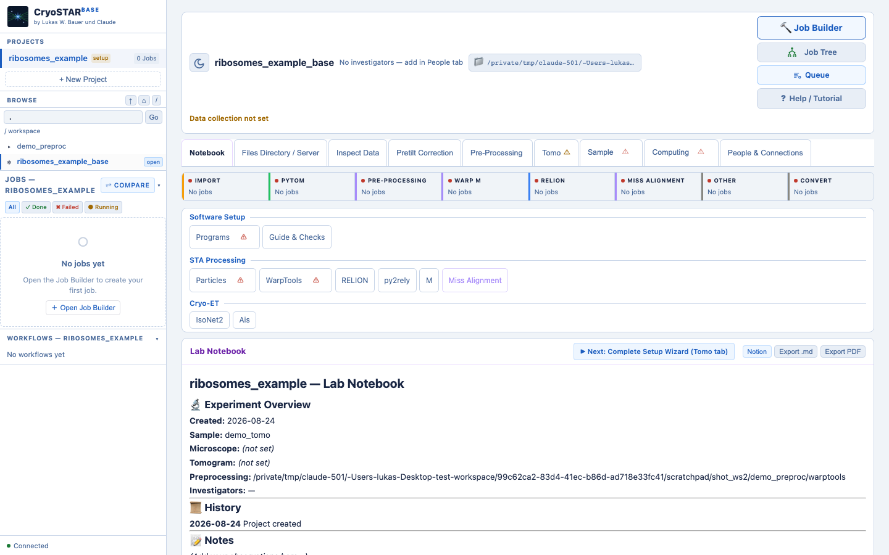
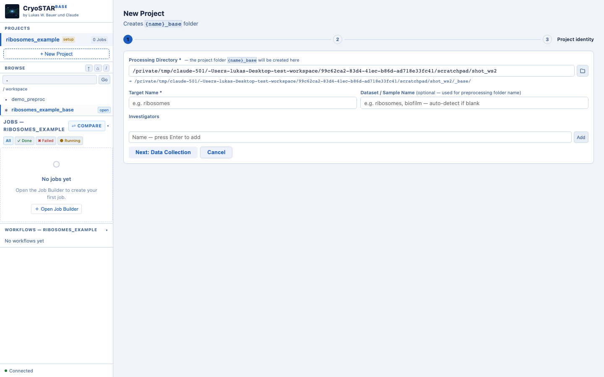
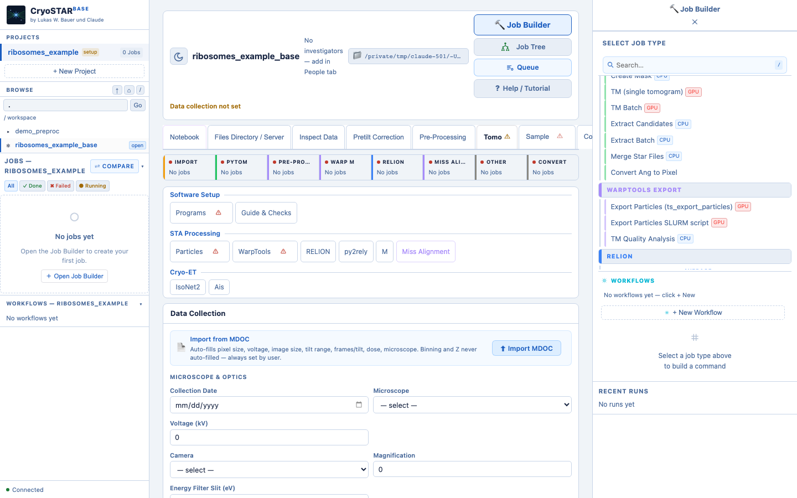
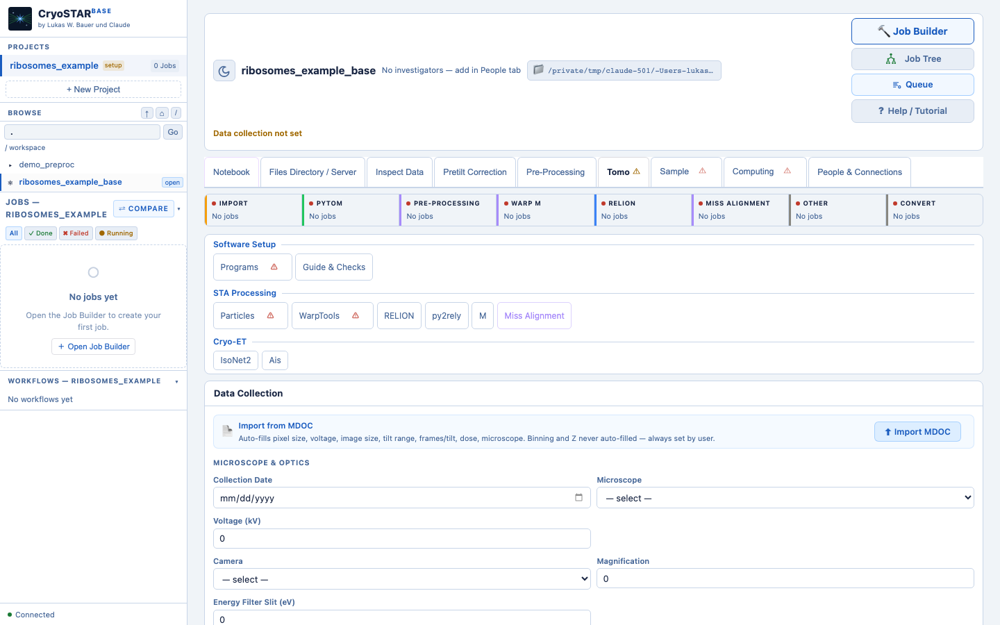
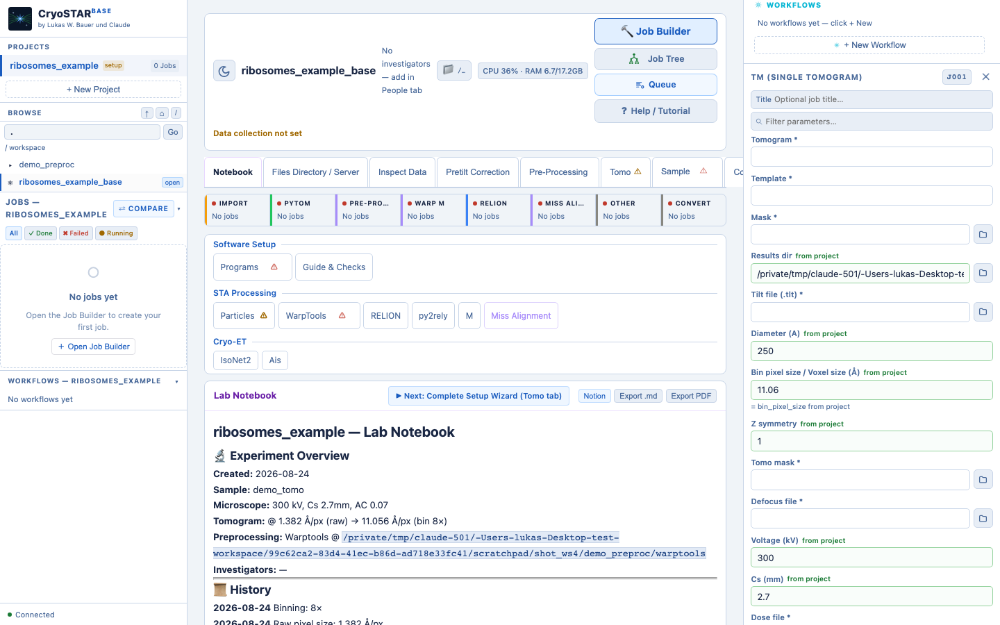
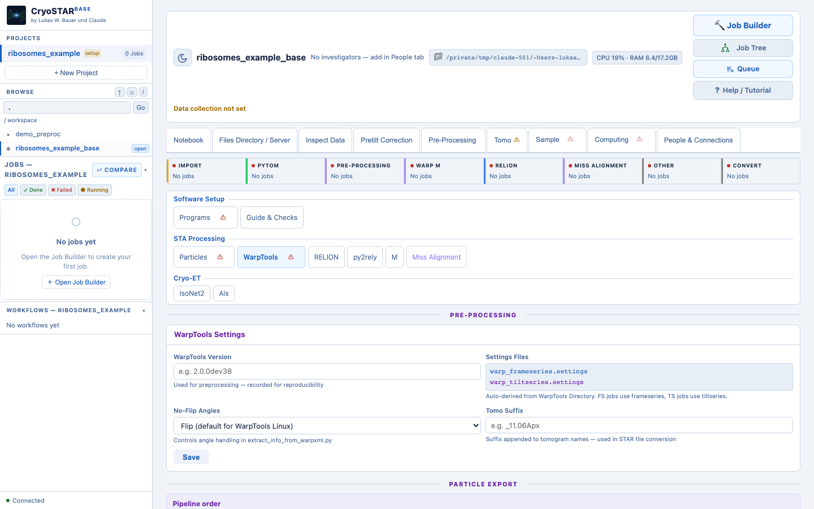
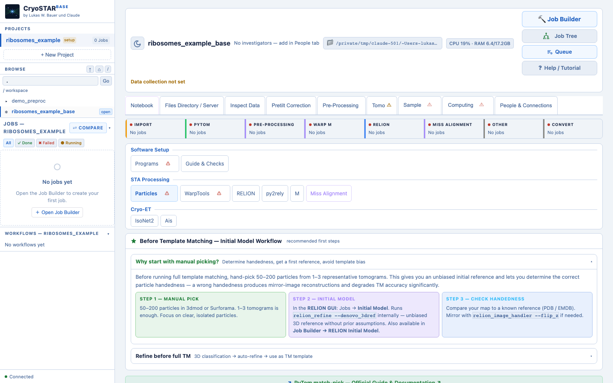
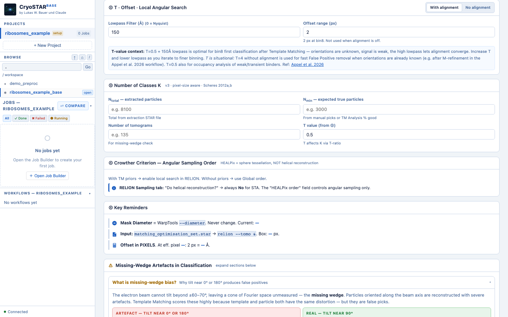
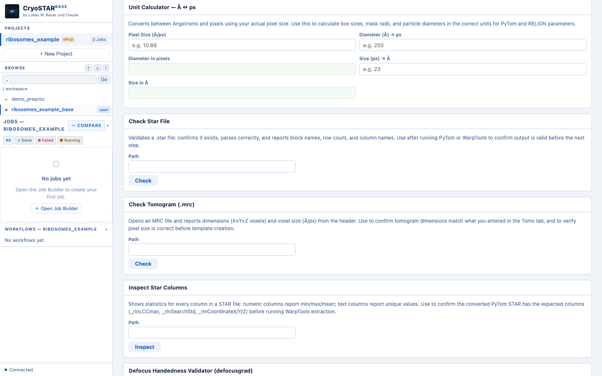

<div align="center">

</div>

# CryoSTAR-Base

> **by Lukas W. Bauer und Claude — 2026**  
> A unified GUI for cryo-ET data processing: from raw frames to subtomogram averaging.

Web-based project management and analysis pipeline for cryo-electron tomography. Integrates AreTomo3, WarpTools, PyTom template matching, and RELION subtomogram averaging into a unified workflow.

<div align="center">

</div>

---

## Installation

```bash
git clone https://github.com/LUKASinScience/CryoSTAR-Base.git
cd CryoSTAR-Base
python3 -m venv .venv
source .venv/bin/activate
pip install -e .
```

**Requirements:** Python ≥3.9. For the full setup guide (HPC/cluster install, permanent shortcuts, troubleshooting), see **[INSTALL.md](INSTALL.md)**.

### Create First Project

```bash
cryostarbase -d /path_example/data
# open http://127.0.0.1:8787
```

1. Click **+ New Project**
2. Enter project name and directory
3. Configure **Tomo** tab (microscope, doses)
4. Set up **WarpTools** environment
5. Run preprocessing and template matching jobs

<div align="center">

</div>

---

## 0. The Interface — Where Everything Is

CryoSTAR-Base opens in your browser. The window has three zones: a **left sidebar**, a **center main area**, and a **right panel**.

### Left sidebar

The sidebar is always visible and contains:

- **Projects** — list of all projects in your workspace. Click to open. Active project is highlighted in blue.
- **Browse** — filesystem navigator. Navigate your workspace directly. Used by the Job Builder file picker (📁 browse buttons).
- **Jobs** — recent job list with status (✓ done, ✖ failed, ● running) and category badges (PREPROC, WARP, PYTOM, RELION).

### Center — Project bar

The bar at the top of the center area (visible when a project is open) contains, left to right:

- **☀ / 🌙** — light/dark mode toggle
- **Project name** and investigators
- **📁 path chip** — full absolute project path (monospace)
- **CPU/RAM or GPU chips** — live resource status. 🟢 free / 🟡 active / 🔴 busy. Hover for details.
- **📁 Local / 🌐 Server toggle** — switches the default browse root for all file pickers between the local workstation filesystem and the configured network share. Appears only when a data server is configured and mounted. Set the server URL once in the **Files tab → Server pill**.

The four buttons on the top right:

| Button | Icon | Function |
|--------|------|----------|
| Job Builder | `🔨` | Opens/closes the right panel with the job builder |
| Job Tree | `⧻` | Pipeline overview — shows all jobs run and their order |
| Queue | `≡` | Job queue panel — sliding in from the right |
| Help / Tutorial | `?` | Opens this handbook |

### Center — Tabs

Two navigation rows below the project bar:

**Overview tabs** (first row): Notebook · Files · Inspect Data · Pretilt Correction · Pre-Processing · Tomo · Sample · Computing · Connect · People

**Workflow pills** (second row, shown when a workflow tab is active): Particles · WarpTools · RELION · py2rely · M · Miss Alignment · AreTomo3 · IsoNet · Ais

**Tabs** are for setup, documentation, and overview — they write to `cryostarbase.json`. **Pills** are pipeline-specific workflow views with Job Builder links and calculators. The Pre-Processing tab contains the WarpTools steps 1–9. The WarpTools pill is for particle export and unbinning.

**Tab status indicators:** Tomo ⚠, Sample ⚠, Computing ⚠ show if required fields are missing. The indicator turns to ✓ when all required fields are saved.

### Right panel — Job Builder

Opens when you click **🔨 Job Builder** or any **"Job Builder →"** button in a tab. Contains:

- **Job type list** — all jobs organized by category with color coding. Press `/` to search.
- **Parameter form** — auto-filled from your project config (`cryostarbase.json`). Fields marked `*` are required.
- **Command preview** — the exact command that will run.
- **▶ Run** — run directly via WebSocket (output streamed, job logged).
- **+ Queue** — add to the job queue instead of running immediately.

<div align="center">

</div>

### Job Builder categories

| Color | Category | Jobs |
|-------|----------|------|
| Orange | Import | ts_import, ts_import_alignments, pretilt_mdocs |
| Purple | WarpTools Pre-Processing | Steps 1–9 + Miss Alignment + Remove Skipped |
| Light blue | AreTomo3 Pre-Processing | aretomo3_batch, collect_alignments |
| Green | PyTom | extract_xml, slabify, create_mask, create_template, tm_batch, extract, merge_stars |
| Blue | RELION | Initial Model, Class3D, Refine3D, PostProcess, Subset, Mask |
| Purple (light) | M / MTools | create_population, create_source, refine, ctf_refine |
| Gray | Convert / Other | mod2star, recenter, custom command |

### GPU status indicators

| Status | Meaning |
|--------|---------|
| 🟢 Green | GPU free — no active processes |
| 🟡 Yellow | GPU active — process running, utilization > 0% |
| 🔴 Red | GPU busy — high utilization |

Hover over a GPU chip to see GPU name, VRAM used/total, and utilization percentage. Chips refresh every 5 seconds.

---

## 1. What is CryoSTAR-Base?

CryoSTAR-Base is a **browser-based project management and pipeline orchestrator** for cryo-ET. It does not replace WarpTools, PyTom, RELION, or IMOD — it connects them into a single interface with automatic parameter flow, job logging, and lab documentation.

**What is a "project"?** In practice, a project usually corresponds to one target — one complex or protein you're solving the structure of. Each project gets its own `cryostarbase.json` config, its own Job Builder history, and its own Lab Notebook, so you can track several targets from the same microscope session side by side without mixing up parameters between them.

**Preprocessing can be shared between projects.** Tilt-series preprocessing (WarpTools/AreTomo3) happens once per dataset, but you might template-match and refine several different targets out of that same dataset. Point multiple projects at the same `warptools_dir` and CryoSTAR-Base automatically detects and shows which projects share preprocessing — so you get a clear overview of what's built on the same raw data, instead of silently duplicating (or accidentally diverging) preprocessing across targets.

**Core philosophy:**
- One project = one `cryostarbase.json` config file that feeds all job parameters
- Every job run is logged with its exact command, output, and timestamp
- The Lab Notebook (`notes.md`) documents your work automatically
- Parameters entered once flow everywhere — no copy-pasting between terminals

---

## 2. Project Structure

Every project lives in a folder inside your workspace:

```
workspace/
  ribosomes_example_base/
    cryostarbase.json          ← all project parameters (the source of truth)
    notes.md                   ← Lab Notebook, auto-updated
    cryostarbase/
      jobs/                    ← one .log file per job with command + output
    inspect_bad_tilts.json     ← manual bad tilt marks from Inspect Data tab
    inspect_selections.json    ← tomogram selections for Miss Alignment
    selected_stacks.txt        ← filtered stack list for WarpTools import

  preprocessing_root/          ← set in Setup → Preprocessing tab
    mdocs/                     ← original MDOC files
    mdocs_pretilt/             ← pretilt-corrected MDOCs (FIB-lamella)
    frames/                    ← raw movie frames (.tif / .eer)
    warptools/                 ← WarpTools working directory
      warp_frameseries/        ← motion-corrected frame averages
      warp_tiltseries/         ← tilt series data
        TS_NAME.xml            ← per-TS WarpTools config (UseTilt, CTF, etc.)
        TS_NAME.mrc            ← tilt stack (inspectable in Inspect Data tab)
        tiltstack/
          TS_NAME/             ← ts_etomo_patches output
            taSolution.log     ← eTomo alignment quality
            TS_NAME.xf / .tlt
        reconstruction/        ← reconstructed tomograms
      import_alignments/
        TS_NAME/               ← collected .xf/.tlt for ts_import_alignments
      warp_tiltseries.settings
    _pytom/                    ← PyTom template matching
      xml/                     ← WarpTools XML copies for PyTom
      template/                ← template .mrc
      mask/                    ← mask .mrc
      results/                 ← *_job.json, *_scores.mrc, *_particles.star
      slabified/               ← tomogram masks from slabify
```

---

## 3. The Project Wizard — Setup Tabs

Open a project and click through the setup tabs in the left panel. **Each tab writes to `cryostarbase.json`** and enables automatic parameter pre-filling in the Job Builder.

| Tab | What you set | Feeds into |
|-----|-------------|------------|
| **Tomo** | Raw pixel size, binning, dimensions, voltage | All jobs with `angpix`, `--diameter`, PyTom voxel size |
| **Sample** | Particle diameter, box size, symmetry | PyTom mask/template, RELION parameters |
| **Preprocessing** | mdocs_dir, warptools_dir, gain reference | All import and preprocessing jobs |
| **Software** | Module load commands for each tool | Job activation commands |
| **Computing** | GPU IDs, SLURM partition, memory | Job builder compute fields |

**Rule:** Fill the tabs *before* running your first job. The checkmarks (✓) in the tab headers confirm that required fields are saved.

---

## 4. MDOC Autofill — The Efficiency Superpower

One MDOC file contains most of your microscope session parameters. In the **Tomo tab**, click **Import MDOC** to parse a `.mdoc` file and automatically fill:

| MDOC field | → Config field | Used in |
|-----------|----------------|---------|
| `PixelSpacing` | `raw_pixel_size` | All angpix fields, PyTom voxel size |
| `Voltage` | `voltage` | WarpTools CTF, RELION |
| `ExposureDose` per section | `dose_per_tilt` | `ts_import --tilt_exposure`, RELION dose weighting |
| `FrameDosesAndNumbers` | `dose_per_tilt` | Fallback if ExposureDose = 0 |
| `DoseRate` + `ExposureTime` | `dose_per_tilt` | Fallback — `DoseRate × ExposureTime / PixelSpacing²` |
| `TiltAngle` range | `tilt_min`, `tilt_max`, `n_tilts` | ts_etomo_patches, documentation |
| `NumSubFrames` | `frames_per_tilt` | alignframes, `--m_grid 1x1xN` |
| `Magnification` | `magnification` | Documentation |
| `FilterSlitAndLoss` | `energy_filter_slit` | Documentation |
| `TargetDefocus` | `target_defocus` | Documentation |
| `SpotSize` | `spot_size` | Documentation |
| `CountsPerElectron` | `counts_per_electron` | Camera calibration reference |
| `T` (scope name) | `microscope` | Lab Notebook |
| `DateTime` | `collection_date` | Lab Notebook |

**Dose calculation — three-source fallback chain:**

1. `ExposureDose` per section (already in e⁻/Ų) — preferred, directly from SerialEM
2. `FrameDosesAndNumbers` × `NumSubFrames` (e⁻/Ų/frame × N frames)
3. `DoseRate [e⁻/px²/s] × ExposureTime [s] / PixelSpacing² [Ų/px²]` — fallback (ETH/ScopeM config)

The source used is shown in the success message after import. `total_dose` is auto-calculated as `dose_per_tilt × n_tilts`. The MDOC filename is stored in `mdoc_source` and shown under the Import button.

> ⚠ `raw_pixel_size` (e.g. 1.071 Å) vs `bin_pixel_size` (e.g. 10.71 Å): RELION calculators use raw, job parameters use binned. They are separate fields — do not mix them.

<div align="center">

</div>

---

## 5. Job Builder — How Autofill Works

Click **🔨 Job Builder** and select a job type. Many fields fill automatically from your project config.

Each job parameter has an optional `from_project` mapping. When you select a job, CryoSTAR-Base reads `cryostarbase.json` and fills the matched fields. Some values are derived:

- `tomo_suffix` = `_` + `bin_pixel_size` rounded to 2 decimal places + `Apx` (e.g. `_10.71Apx`)
- `pytom_voxel_size` = `bin_pixel_size` rounded to 2dp (matches WarpTools MRC header exactly)
- `warptools_tiltstack_dir` = `warptools_dir/warp_tiltseries/tiltstack`
- `pytom_results_dir` = `project_dir/_pytom/results`

Fields shown in green with "from project" are auto-filled. If a field is empty, the config value is not yet set — go to the relevant Setup tab and save.

> **Tomo dimensions:** X and Y fill automatically from MDOC import. Z must be set manually in the Tomo tab. Once Z is saved, all three dimensions prefill in the Job Builder (ts_reconstruct, Miss Alignment stack dimensions).

Here's a PyTom template matching job (`tm_single`) right after opening it — diameter, voxel size, symmetry, voltage, and Cs are already filled in from the project config, all marked `from project`:

<div align="center">

</div>

---

## 5b. Data Server (Network Share)

If your data lives on a network file server instead of the local disk, CryoSTAR-Base can browse it directly in the browser — no manual mounting every session.

**What you need:** the network address of the share, in the format your IT/lab admin gives out for Windows-style network shares (this is also what most NAS devices and Samba-based Linux servers speak): `smb://<server-hostname>/<share-name>/`, e.g. `smb://path_example/share/`.

**One-time setup:**
1. Files tab → click **Server** pill
2. Enter the share address, e.g. `smb://path_example/share/`
3. Click **Save**
4. On the workstation (Linux, via GNOME's `gio`): `gio mount smb://path_example/share/`

The **📁 Local / 🌐 Server toggle** then appears in the topbar. Click to switch all file pickers (Job Builder, Pretilt Correction tab, etc.) between the local workstation and the mounted share. Preference is saved across sessions.

> Only this share format is supported right now (via Linux's GVFS/`gio mount`) — not other network filesystem protocols.

---

## 6. Preliminary Processing Workflow

For standard datasets, WarpTools handles motion correction and eTomo alignment automatically:

```
Optional: Pretilt Correction Tab → Pretilt MDOC correction
          (FIB-lamella only — corrects TiltAngle in MDOCs)

Job Builder:
  create_settings (fs) → fs_motion_and_ctf
  create_settings (ts) → ts_import
                         [--tilt_offset = pretilt_angle if FIB-lamella]
  ts_etomo_patches      ← eTomo patch tracking, fully automated
  ts_import_alignments  ← --alignments warp_tiltseries/tiltstack/
  warp_remove_skipped   ← reads taSolution.log from tiltstack/TS_NAME/
  ts_defocus_hand → ts_ctf → ts_reconstruct
```

For AreTomo3-based preprocessing, use `get_aretomo3_alignments.py` to collect
its `.xf`/`.tlt` output into the per-tilt-series folder structure that
`ts_import_alignments` expects, then continue with the same Job Builder chain.

---

## 7. WarpTools Pipeline — Step by Step

| Step | Job | What it does | Output |
|------|-----|-------------|--------|
| 1 | `create_settings (fs)` | Frame series settings file | `warp_frameseries.settings` |
| 2 | `create_settings (ts)` | Tilt series settings file | `warp_tiltseries.settings` |
| 3 | `fs_motion_and_ctf` | Motion correction + CTF for all frames | `warp_frameseries/*.xml` |
| 4 | `ts_import` | Import MDOC metadata | `tomostar/*.tomostar` |
| 5 | `ts_etomo_patches` | Automated eTomo patch tracking | `tiltstack/TS_NAME/*.xf/.tlt/taSolution.log` |
| 6 | `ts_import_alignments` | Import alignment into WarpTools | Updated `warp_tiltseries/*.xml` |
| 7 | `warp_remove_skipped` | Set UseTilt=False for bad views | Updated `warp_tiltseries/*.xml` |
| 8 | `ts_defocus_hand` | Determine defocus handedness | Pass/fail check |
| 9 | `ts_ctf` | Per-tilt CTF estimation | `warp_tiltseries/*.xml` with CTF |
| 10 | `ts_reconstruct` | Reconstruct tomograms | `reconstruction/*.mrc` |

<div align="center">

</div>

---

## 8. Remove Skipped Views — Modes Explained

There are two separate jobs for removing bad tilts from WarpTools XMLs:

**Remove Skipped Views (eTomo)** — automatic, reads `taSolution.log` from eTomo alignment:

| Mode | How to use | When |
|------|-----------|------|
| **Standard** | Leave optional fields empty | After ts_import_alignments |
| **Reactivate all** | Check "Reactivate all tilts" | Before Miss Alignment (needs all tilts active); to undo |
| **Keep N lowest-exposure** | Set N tilts | Fast reconstructions; consistent subset |
| **Exclude high tilts** | Set max tilt angle | FIB-lamella where high-tilt images lose quality |

**Remove Bad Tilts (Inspect)** — manual, reads `inspect_bad_tilts.json` from Inspect Data tab markings. Run after visual inspection.

**Import TomoScout Bad Tilts** (Import category) — imports bad tilt JSON from TomoScout into the project. Replace or Merge mode.

> **Safety:** backup_name must be a new directory that does not exist yet — acts as a write-once lock.

---

## 9. Inspect Data Tab — Bad Tilt Workflow

The Inspect Data tab has two sub-tabs:

**Tilt Stacks** — visual inspection of tilt series after `ts_import`:
- Folder: `warp_tiltseries/` (auto-filled)
- Navigate: ← → arrow keys or click filename list
- Mark bad: press **B** to toggle current slice as bad; use range input to mark multiple at once
- Save: automatic on every mark → written to `project_dir/inspect_bad_tilts.json`
- Apply to XMLs: Job Builder → **Remove Bad Tilts (Inspect)** → reads `inspect_bad_tilts.json`, sets `UseTilt=False` in WarpTools XMLs

Performance on large datasets: the viewer uses `mrcfile.mmap()` (no full file load), 1536px JPEG downscaling, browser-side caching, and prefetches ±3 neighbouring slices — navigation stays fast even over the network.

**Tomograms** — tomogram viewing and Miss Alignment exclusion management:
- Set folder: `warp_tiltseries/reconstruction/` (auto-filled)
- **Generate preview GIF** — cached per tomogram for fast re-viewing
- **Open in BatchTomoViewer** — external PyQt6 viewer (path set in Software Setup)
- **Open in Tomo Viewer** — trame-based browser viewer, opens in a new tab on port 8788. Requires `pip install cryostarbase[trame]`. For remote access add a second SSH tunnel: `-L 8788:localhost:8788`
- Select which tomograms to include/exclude from Miss Alignment training → `inspect_selections.json`

**Bad tilts from TomoScout:** Job Builder → Import → **Import TomoScout Bad Tilts** → imports a TomoScout `inspect_bad_tilts.json` into your project. Replace mode: overwrites existing. Merge mode: union with existing manual markings.

**Workflow tip:** run `warp_remove_skipped` first (automatic bad tilt removal from taSolution.log), then Inspect Data to catch anything eTomo missed, then **Remove Bad Tilts (Inspect)** to apply to XMLs.

---

## 10. Queue System

The **Queue** (toolbar button) is a direct submission queue for running multiple jobs in sequence without manual intervention.

**When to use the Queue:**
- You want to run 3–5 jobs back-to-back overnight
- You need a specific order (e.g. ts_ctf → ts_reconstruct → PyTom TM)
- You want GPU-aware scheduling (queue pauses if GPU is busy)

**Modes:**
- **GPU-aware:** waits for GPU to be free between jobs
- **Sequential:** runs jobs one after another regardless of GPU state

**How it works:** add jobs to the queue from the Job Builder (Queue button instead of Run). The queue runs in the background — you can close the Job Builder panel.

The queue is different from SLURM submission: it runs jobs directly on the workstation using your current session.

---

## 11. PyTom Template Matching Pipeline

```
PyTom Jobs (category: pytom)
  extract_warp_xml    → _pytom/xml/   (copies WarpTools XMLs)
  slabify_loop        → _pytom/slabified/  (creates tomogram masks)
  create_mask         → _pytom/mask/mask.mrc
  create_template     → _pytom/template/template.mrc
  tm_batch / tm_single → _pytom/results/*_job.json + *_scores.mrc
  extract_batch       → _pytom/results/*_particles.star (per TS)
  merge_stars         → _pytom/results/merged.star
  convert_coords      → _pytom/results/converted.star
                        (converts Å coords → pixels, preserves LCCmax/CutOff/SearchStd)
  pytom2warp_export   → WarpTools ts_export_particles
```

**Score columns preserved:** `_rlnLCCmax`, `_rlnCutOff`, `_rlnSearchStd` are kept through the full pipeline from extract → merge → convert → export.

<div align="center">

</div>

Particles then flow into RELION for subtomogram averaging. RELION runs in its own GUI (`relion --tomo &`) — CryoSTAR-Base builds and runs the individual jobs from the command line, or submits them via SLURM, through the **RELION** workflow pill, which includes pixel-size-aware calculators for T, offset, number of classes (K), and angular sampling order (Crowther criterion):

<div align="center">

</div>

General-purpose unit conversion and STAR/MRC validation calculators live separately, under **Guide & Checks** in Software Setup:

<div align="center">

</div>

---

## 12. Miss Alignment

Miss Alignment is a self-supervised deep learning alignment refinement tool. It runs **after** `ts_reconstruct` (needs reconstructed tomograms) and **before** repeating CTF + reconstruction.

```
Correct order:
  ts_import_alignments → ts_defocus_hand → ts_ctf → ts_reconstruct
       ↓
  miss_alignment_train   ← on reconstructed tomograms
       ↓
  ts_defocus_hand → ts_ctf → ts_reconstruct   ← repeat with refined alignment
```

> **Important:** `warp_remove_skipped` breaks Miss Alignment (UseTilt=False conflicts with training). If using Miss Alignment, run it *before* remove_skipped, or reactivate all tilts first (check "Reactivate all tilts" in remove_skipped), run Miss Alignment, then re-run remove_skipped.

Miss Alignment requires: WarpTools XML dir, stack dimensions (auto-filled from project config), volume dimensions, pixel size.

---

## 13. Lab Notebook (notes.md)

Every project has a `notes.md` that serves as a living lab notebook.

**Auto-documented:** when you save Setup tabs, key parameters (voltage, pixel size, particle diameter, collection date, investigator) are appended to notes.md.

**Manual notes:** click the **Notebook** tab to edit directly in the browser. Supports full Markdown.

**Export:** Export as `.md` or PDF. The `.md` file can be opened in any text editor or rendered on GitHub.

**Notion sync:** if configured, notes sync to a Notion page (requires Notion API token in Software Setup).

---

## 14. Keyboard Shortcuts

| Key | Action |
|-----|--------|
| `/` | Search job types in Job Builder |
| `+` | Open Job Builder |
| `Esc` | Close panel / cancel |
| `n` | Jump to Notebook tab |
| `b` | Browse files |
| `B` | Toggle bad tilt (Inspect Data tab) |
| `←` `→` | Previous / next tilt (Inspect Data) |
| `↑` `↓` | Previous / next tilt series (Inspect Data) |

---

## 15. Tips & Common Pitfalls

**pixel_size vs raw_pixel_size**  
`raw_pixel_size` = detector pixel size (e.g. 1.071 Å). `bin_pixel_size` = after binning (e.g. 10.71 Å). RELION calculators use raw; all WarpTools/PyTom jobs use binned. They are separate — entering the wrong one silently breaks downstream resolution estimates.

**tomo_suffix**  
Automatically derived as `_` + `bin_pixel_size` to 2 decimal places + `Apx`. E.g. `bin_pixel_size = 10.712` → `tomo_suffix = _10.71Apx`. The 2dp rounding matches the WarpTools MRC header exactly, preventing voxel-size mismatch warnings in PyTom.

**MDOC pretilt for FIB-lamella**  
FIB-lamella datasets have a physical stage pretilt (typically ±9°). Use either:
- Pretilt Correction Tab → Pretilt Correction → corrects MDOCs before ts_import
- Or: `ts_import --tilt_offset {pretilt_angle}` directly in the job

Both approaches result in the same corrected tilt angles in WarpTools.

**ts_import_alignments folder structure**  
`ts_import_alignments` expects **one sub-folder per tilt series** (e.g. `import_alignments/TS_NAME/TS_NAME.xf`), not a flat folder. `ts_etomo_patches` already writes into this structure directly (`warp_tiltseries/tiltstack/TS_NAME/`) — point `--alignments` there. For AreTomo3-derived alignments, `get_aretomo3_alignments.py` builds the same structure. Do not manually copy .xf files into a flat directory.

**warp_remove_skipped backup**  
The backup folder must not already exist — this prevents accidental double-runs from overwriting your XML backup. Use a date-stamped name like `xml_backup_20260622_all_tilts`.

**Miss Alignment + remove_skipped order**  
Miss Alignment needs all tilts active. Run Miss Alignment first, then remove_skipped. Or: reactivate all tilts → Miss Alignment → remove_skipped → re-reconstruct.

---

## Features

- Multi-project workspace management
- Data collection metadata tracking
- AreTomo3 → WarpTools → PyTom → RELION pipeline
- Real-time job monitoring via WebSocket
- Jupyter-style analysis notebooks
- Light/Dark mode interface

---

## Command-Line Options

```bash
cryostarbase --help

  -d, --workspace-dir PATH  Browse directory (default: current)
  -p, --port PORT          Server port (default: 8787)
  --host HOST              Bind address (default: 127.0.0.1)
  --version                Show version
```

---

## Documentation

- **Installation Guide:** [INSTALL.md](INSTALL.md)
- **In-App Handbook:** [cryostarbase/frontend/handbook.md](cryostarbase/frontend/handbook.md) — same content as above, served live inside the app via the `?` Help button
- **Version History:** [CHANGELOG.md](CHANGELOG.md)
- **API Reference:** `/api/docs` (when server is running)

---

## External Tools

CryoSTAR-Base is an orchestrator, not a replacement — it drives these tools, it doesn't ship them. Install them separately.

**Required for the standard pipeline:**

- [WarpTools](https://warpem.github.io/warp/) — preprocessing & CTF
- [IMOD](https://bio3d.colorado.edu/imod/) — eTomo patch-based tilt series alignment (`ts_etomo_patches`)
- [PyTom](https://github.com/SBC-Utrecht/PyTom) — template matching
- [RELION](https://relion.readthedocs.io) — subtomogram averaging

**Optional / alternative paths:**

- [AreTomo3](https://msg.ucsf.edu/software) — alternative to IMOD's eTomo alignment step
- Miss Alignment (bundled deep-learning refinement) — optional alignment refinement, not required for a first pass

---

## License

MIT — see [LICENSE](LICENSE).

---

## Authors

Lukas W. Bauer und Claude

---

## Acknowledgments

PyTom, RELION, Warp, and AreTomo3 developers
